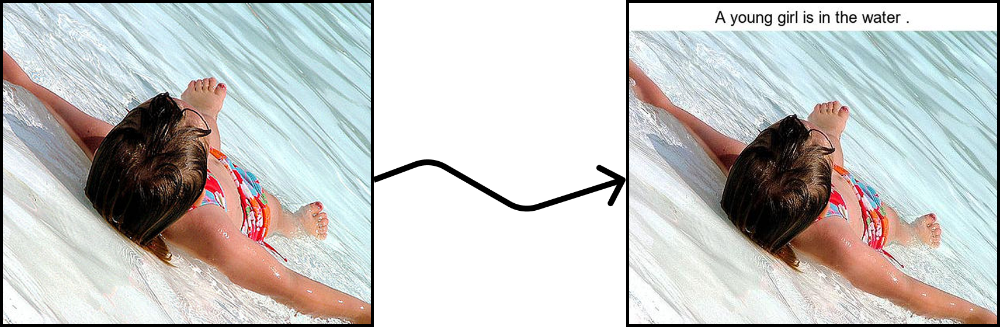
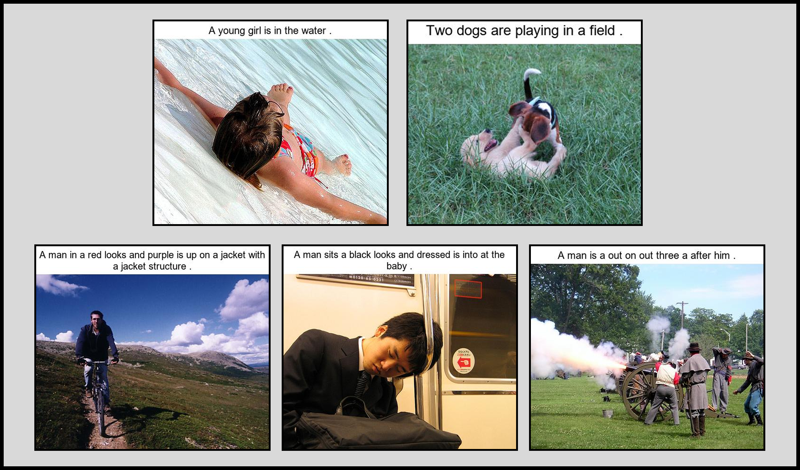

# Automatic Image Captioning

Caption: A young girl is in the water.

## Introduction 

This project implements an automatic image captioning system that generates descriptions for images by combining computer vision and natural language processing. The system extracts visual features from images and produces readable captions. The project was built using PyTorch, Flickr8k dataset and a CNN to RNN architecture. 

## Project Overview

### The goal of this project is to develop and end to end image captioning system capable of generating accurate captions for different images. 

* **Dataset**: Flickr8k, containing ~8,000 images with ~5 captions each.
* **Model**: A CNN to RNN architecture with a pre-trained ResNet50 encoder and LSTM decoder.
* **Training**: Optimised using CrossEntropyLoss over 10 epochs with a batch size of 32 and learning rate of 3e-4.
* **Evaluation**: Measured by BLEU-4 score.
* **Visualisation**: A tool to overlay generated captions on images using Pillow.

## Data 

The Flickr8k dataset has ~8,000 images with ~40,000 captions (~5 per image). The images are first resized to 224x224 pixels and normalised for ResNet50. The captions are then tokenised and numericalised using a custom **Vocabulary** class (frequency threshold: 5), and padded with special tokens({<SOS>: Start Of Sentence, <EOS>: End Of Sentence, <PAD>: Padding, <UNK>: Unknown}). The vocabulary size is ~3,000 words and current issue I have is that the dataset is not properly split between train, validation, and test splits. This leads to overfitting, I will fix this in the future.

## Model Design

### My architecture includes:

* Encoder:
  * Pre-trained ResNet50 extracts visual features from images
  * Removes the final fully connected layer, outputting a 2048-dimensional feature vector.
  * Applies a linear layer to reduce features to 256 dimensions (embedSize), follow by batch normalisation
* Decoder:
  * **LSTM** with 1 layer, 512 hidden units, and an embedding size of 256.
  * Takes image features and previous words to predict the next word in the caption sequence.
  * Uses teacher forcing during training to optimise work predictions
* Inference:
  * Autoregressive generation starts with image features, creating captions until <EOS> or a maximum length set at 50.
* Training vs. Inference:
  * Training: Uses teacher forcing, where the model is fed the ground-truth caption words as inputs and predicts the next word. For example, for the caption "A dog runs," it gets "A" and predicts "dog," then gets "dog" and predicts "runs."
* Limitations:
  * There is no attention mechanism, I will make modifications for this in the future.  
  * During inference errors early in the sequence can compound, leading to poor captions that don’t match ground-truth, lowering the BLEU score.

## Training and Results

### Training Setup:
I trained my model for 10 epochs using the Adam optimiser set with a learning rate of 3e-4 (0.0003). I set a batch size of 32 and the loss function was CrossEntropyLoss. The training is also device agnostic able to be trained on either CPU or GPU (CUDA), I trained on GPU. 

### Results: 
* **Training Loss**: 1.7705
* **Validation Loss**: 1.6418
* **BLEU-4 Score** : 0.0786 (low due to evaluation issues)

### Analysis:

Low losses indicate effective word prediction during training, but the lowe BLEU-4 score suggests poor caption quality during inference. Reasons for the poor BLEU-4 score are single reference caption used for BLEU, whereas Flickr8k provides ~5. Another reason for poor performance could be overfitting due to identical train/validation/test datasets. I would expect a BLEU-4 score of between ~0.5-0.65 with proper splits and multiple refernces. My visualisation of results was generated captioned images with clean, wrapped text overlaid using Pillow, handling long captions dynamically.

## Challenges and Solutions
* Low BLEU Score:
  * Using only one reference caption per image.
  * Lack of dataset splits, causing overfitting.
    * **Solution**: Implement splits, use all ~5 references.
* Text Visualisation:
  * Long captions exceeded image width when overlaid, requiring text wrapping and dynamic caption area resizing.
   * **Solution**: Resolved using Pillow's textbbox and a custom wrapText function.
* Model Limitations:
  * Absence of attention reduces caption specificity.
  * Small dataset (Flickr8k) reduces generalisations when compared to larger datasets like MS COCO
* Preprocessing:
 * Ensuring consistent image and caption handling (e.g. numericalisation)

## What I learned
* Deep Learning:
  * Gained experience with encoder-decoder architectures, combining CNNs and RNNs for image captioning
* PyTorch:
  * More practice at designing building, training, and testing models.
* Computer Vision and NLP:
  * Understanding feature extraction with pre-trained CNNs and sequence generation with LSTMs.
  * Looked into evaluation metrics like BLEU-4.
* Image Processing:
  * Using Pillow for text overlay, handling font rendering, text wrapping, and dynamic layouts.
* Future:
  * To enhance the model with attention mechanisms and train on correctly split larger datasets.
  * Improve evaluation by fixing BLEU calculation.

## Dependencies

- Python 3.8+
- PyTorch
- Pillow
- nltk
- pandas
- scikit-learn
- pickle

## Showing both accurate test captions and non accurate test captions

